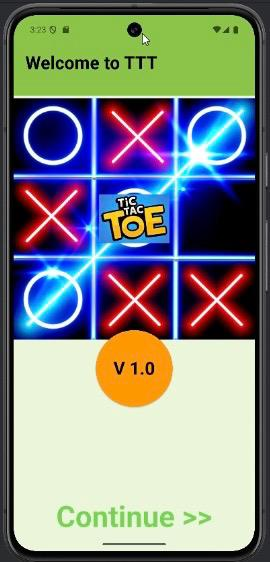
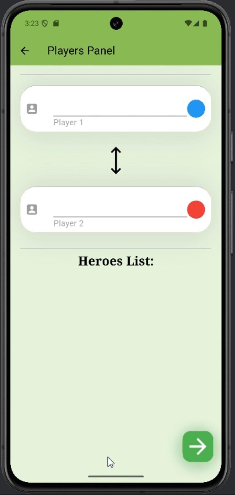
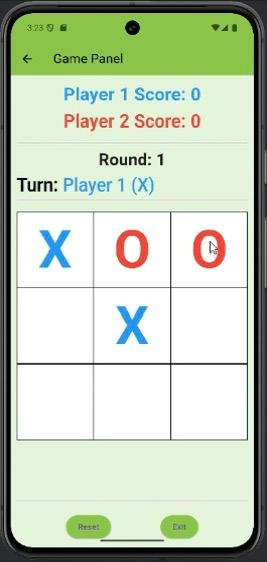
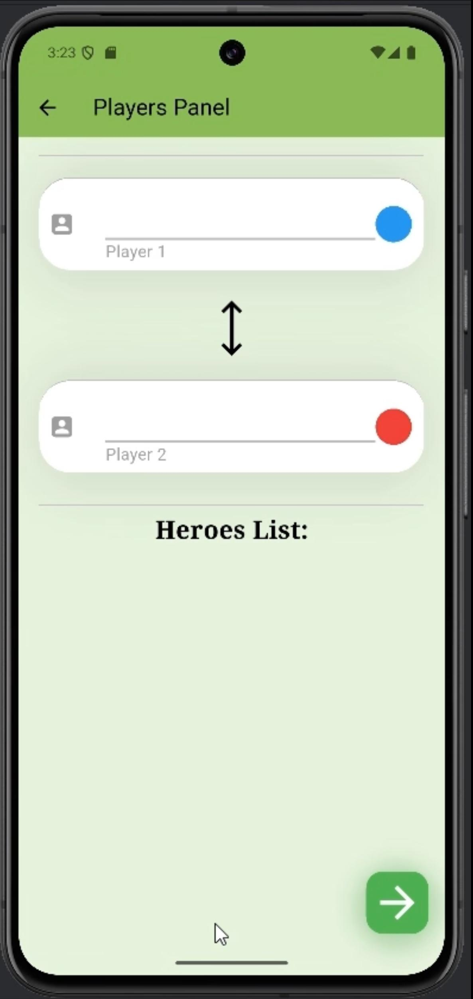

# tic_tac_toe_game

My First Flutter project.

# Tic Tac Toe Images

🎮 **Project Introduction Video**
Click on the video above to see how the game works.

## Getting Started

This project is a starting point for a Flutter application.

A few resources to get you started if this is your first Flutter project:

For help getting started with Flutter development, view the
[online documentation](https://docs.flutter.dev/), which offers tutorials,
samples, guidance on mobile development, and a full API reference.
